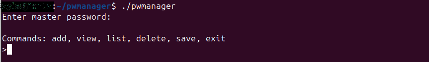
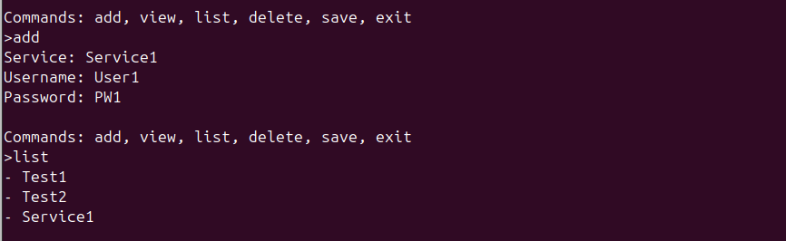
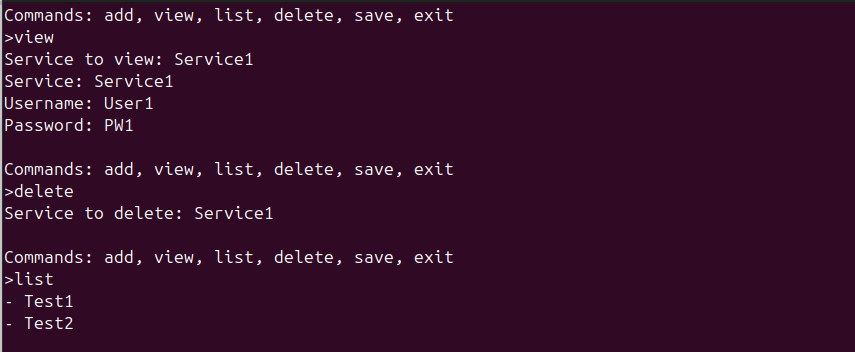
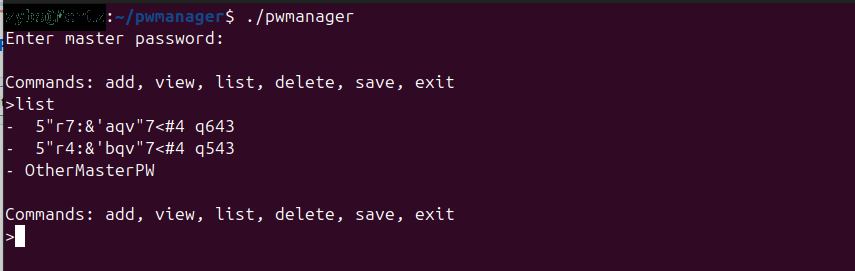

# PasswordManager
Welcome to my PasswordManager, a simple system to save multiple passwords one place using a master password to view them.
The list is based on the master password, so you can have multiple list on different master passwords and see passwords accordingly.

## How to use
After starting the program you get asked for a master password. (which will be invisbile while writing)
Then you have following commands: add, view, list, delete, save, exit

**add -** adds a service you get promted which service you want to add (Eg. Gmail) then Username and last Password

**list -** shows avalible services

**view -** Views the username & password of a chosen service

**delete -** Deletes a service

**save -** Saves recently added services to the dat file (remember to use this command before exiting the program)

**exit -** closes the program

Heres a presentation with another master password used, here we have created a single service for the other master password

